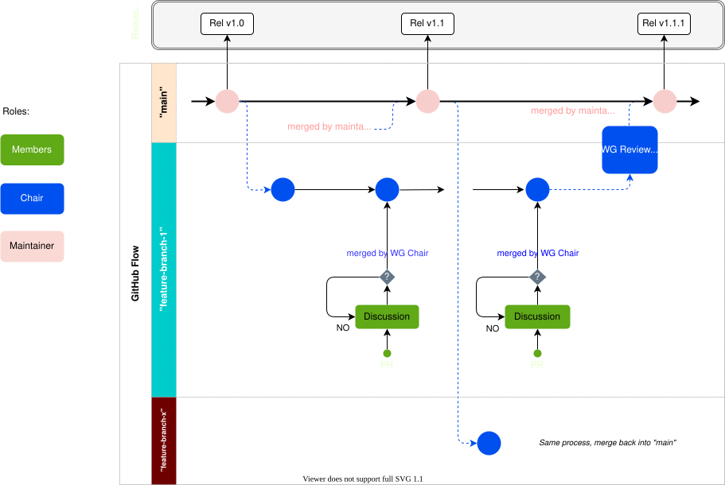

# [WG Name]

## Scope
{add scope}

## Appointments 
- Chair - Name {company}
- V.Chair - Name {company}

## Project Details
{add additional information for the reader to understand the project}

## Resources

* [Add me to meeting](add link)
* [Shared Google Drive](add link)
* [Slack Channel](add link)
* [Add me to your project email distribution list](add link)

## GitHub Training 
- [Getting started with GitHub](https://openchain-project.github.io/github-training/)

Any question, please submit an [issue](https://github.com/OpenChain-Project/template-repo-for-new-projects/issues/new?assignees=shanecoughlan&labels=question&template=question.md&title=%5BQuestion%5D)

## GitHub Training

* [Getting started with GitHub](https://openchain-project.github.io/github-training/)

## Collaborating with GitHub
<figure>
	
	<figcaption></figcaption>
</figure>

- See [The Way we Work](https://github.com/OpenChain-Project/the_way_we_work/blob/main/Rules/the_way_we_work.md) for futher details.

## Help
helpdesk@lists.openchainproject.org 
